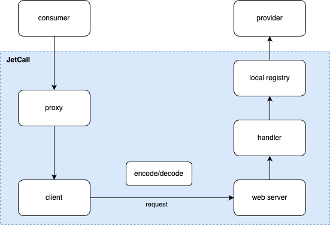
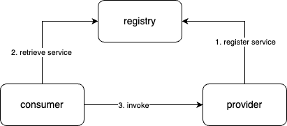

JetCall 是一个简易的、用于学习性质的 RPC 框架。其实现了序列化、网络通讯的基础功能，同时也提供了一些服务治理的相关能力，比如服务发现、负载均衡、超时重试等。

## 什么是 RPC

**RPC** (Remote Procedure Call) ，即远程过程调用。通俗来讲，就是像本地调用一样，调用远端服务的某个方法，并获取到对应的响应。RPC 本质上定义了一种通信的流程，而具体的实现技术没有约束，核心需要解决的问题为**序列化**与**网络通信**。如可以通过 `protobuf` 来序列化和反序列化消息内容，通过 `socket/http` 来进行网络通信。只要客户端与服务端在这两方面达成共识，能够做到消息正确的解析接口即可。

### RPC 的调用流程

一次 rpc 调用包括以下基本流程，分为客户端和服务端两个部分：

1. （客户端）构造请求参数，发起调用
2. （客户端）通过服务发现、负载均衡等得到服务端实例地址，并建立连接
3. （客户端）请求参数序列化成二进制数据
4. （客户端）通过网络将数据发送给服务端

------

1. （服务端）服务端接收数据
2. （服务端）反序列化出请求参数
3. （服务端）handler 处理请求并返回响应结果
4. （服务端）将响应结果序列化成二进制数据
5. （服务端）通过网络将数据返回给客户端

------

1. （客户端）接收数据
2. （客户端）反序列化出结果
3. （客户端）得到调用的结果

## 为什么用 RPC

RPC 并非一种具体的协议，而是一种概念和设计思想。实现 RPC 的传输协议可以基于 TCP，也可以基于 HTTP 等协议。然而，既然使用 HTTP 也能够完成请求和响应的通信流程，为什么还需要设计 RPC 呢？

首先，**RPC 提供了更高的抽象性**。它将远程调用封装为类似本地函数调用的形式，使开发者无需关注底层的网络通信细节，从而专注于业务逻辑开发。其次，**RPC 支持灵活的传输协议**，例如直接使用 TCP 或二进制协议进行通信，这能够有效减少 HTTP 协议头等冗余信息所带来的开销，提高传输效率。

在复杂的企业业务场景中，系统间调用频繁且数据流量大。此时，**使用轻量化的 RPC 协议可以显著降低数据传输的开销**，尤其适用于高并发、低延迟的场景。此外，大型企业的技术栈通常多样化（如后端使用 Java、Go，机器学习采用 Python，前端则依赖 JavaScript 等）。RPC 基于 **IDL（接口定义语言）**，能够自动生成客户端和服务端的接口代码，从而在多语言环境中简化开发流程，减少因语言差异带来的集成成本。

## JetCall 治理特性

### 服务发现

RPC 框架中的核心模块之一是**注册中心**，其主要作用是为服务调用方动态提供服务提供方的地址，从而避免将服务调用地址硬编码到项目中。JetCall 默认采用 **Etcd** 作为注册中心。在项目初始化阶段，`provider` 模块会将其提供的服务注册到 Etcd 中。同时，注册中心还具备 **服务发现**、**心跳检测** 和 **服务注销** 等功能，确保服务的高可用性和动态扩展能力。

### 负载均衡

在方法调用过程中，针对同一服务可能存在多个服务提供者的情况，如何合理分配请求到不同节点显得尤为重要。这不仅能够提升系统的性能，还能有效避免单点瓶颈问题。JetCall 内置了两种负载均衡策略，分别是**轮询算法**和**一致性哈希算法**。

#### 一致性哈希

一致性哈希算法是一种分布式系统中常用的负载均衡算法，主要用于解决节点动态增减时数据分布的平稳性问题。它将数据和节点映射到一个逻辑环上，通过哈希函数计算数据的哈希值，确定其在环上的位置，并将数据存储在顺时针方向第一个节点上。当节点加入或退出时，仅需重新分配少量数据，从而减少数据迁移，提高系统的稳定性和扩展性。

## 重试机制

JetCall 实现了 **指数退避** 的重试机制。在服务提供者返回错误、网络不稳定，或因服务提供者重启导致 RPC 调用失败的情况下，服务调用方能够自动触发重试，从而有效提升系统的可用性和稳定性。
